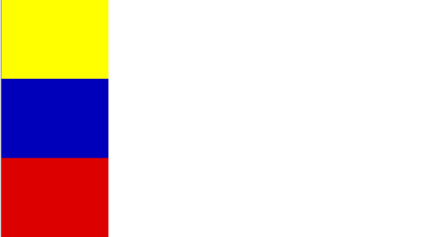
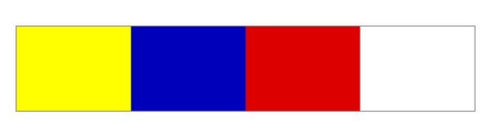
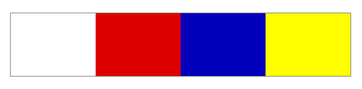

# La Bandera 

Ejercicio Enunciado de la Lección 28 - Floating: Left, Right y Clearfix,

## Composición

* El ejercicio esta compuesto por 3 ramas y la rama Master.

* [Ejercicio 1](https://github.com/FiorellaQA/Banderas/tree/Ejercicio1)

* [Ejercicio 2](https://github.com/FiorellaQA/Banderas/tree/Ejercicio2)

* [Ejercicio 3](https://github.com/FiorellaQA/Banderas/tree/Ejercicio3)

* [Ejercicio finalizado](https://fiorellaqa.github.io/Banderas/)